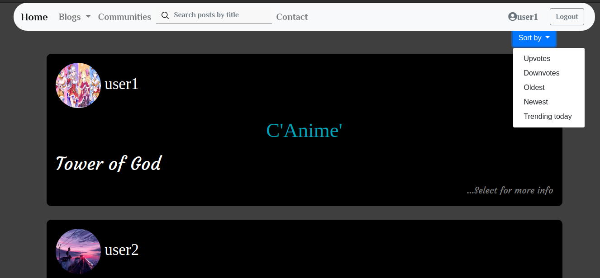
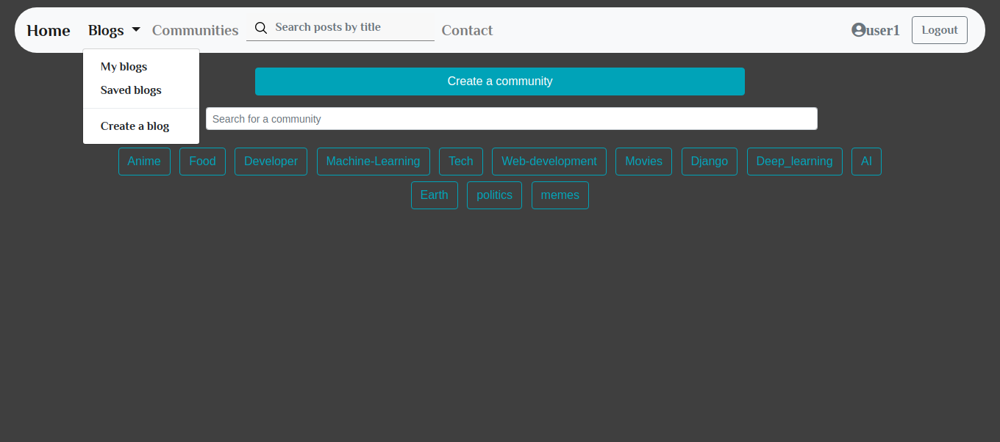
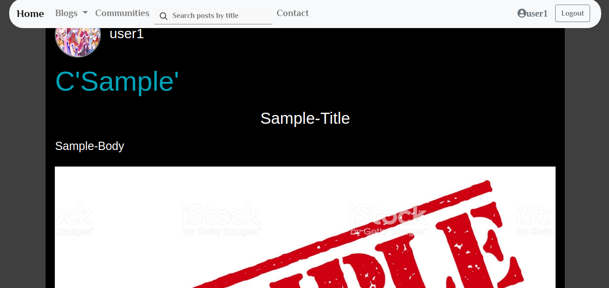
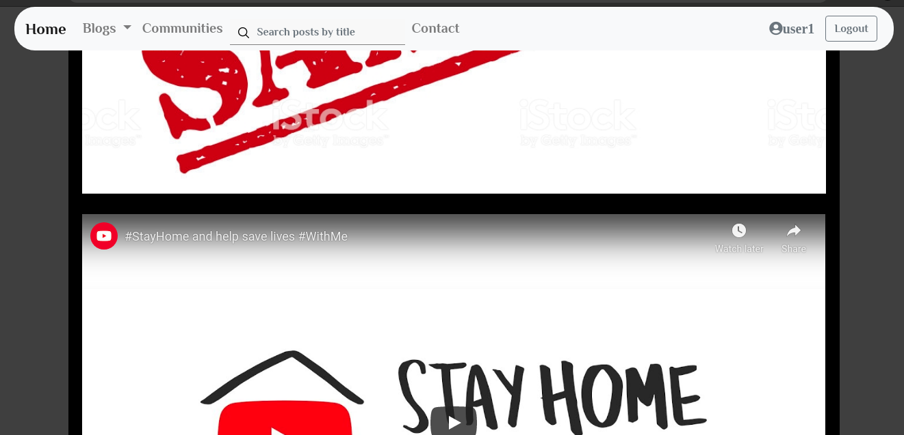
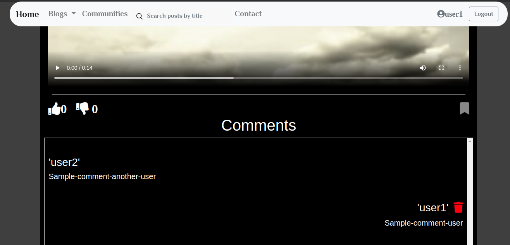

# Blogs
## :exclamation::exclamation: Under-Development :exclamation::exclamation:
## Features 
* Dynamic
* Google sign in
* Use of Ajax
* Use of Pagination
## Guide
&nbsp; 1: Install Anaconda from : https://www.anaconda.com/products/individual <br />
&nbsp; 2: Install environment from environment.yml file  <br />
```
conda env create -f environment.yml
```
&nbsp; 3: Get a list of environments 
 ``` 
 conda env list 
 ```
&nbsp; 4: To activate environment 
```
conda activate env_name 
```
## To Run 
&nbsp; Go to directory where the project is downloaded
```
python manage.py runserver
```






